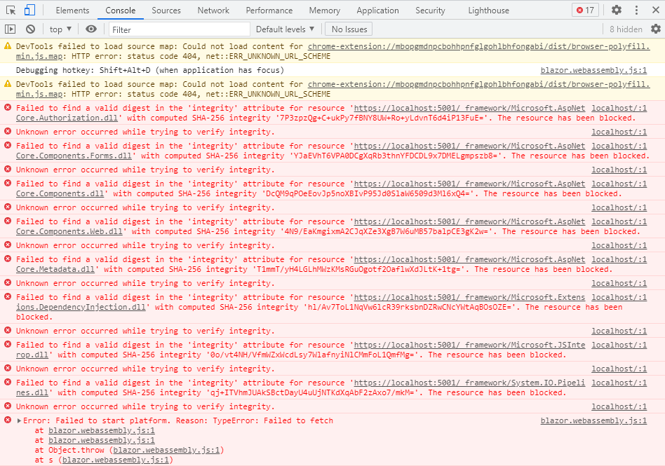

# BlazorStateTutorial
Code following this tutorial: https://timewarpengineering.github.io/blazor-state/Tutorial.html

Currently at step "Displaying State in the User Interface." but blocked by the following error messages. I have tried this multiple times on multiple days but I always get these same messages. I have not yet had the opportunity to test on a separate machine though.

